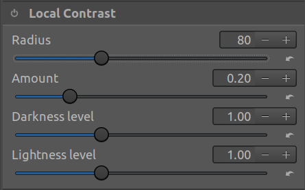
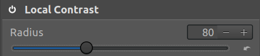
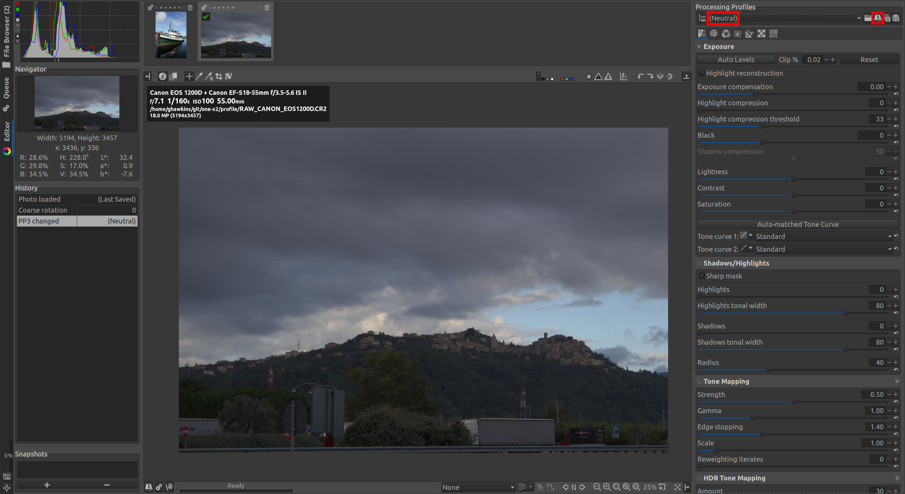

Duplicating Greg Zaal's HDRI profile
====================================

The following page describes trying to create an identical RawTherapee profile to the one Greg Zaal uses for his HDRIs.

RawTherapee UI
--------------

The RawTherapee UI is a little unusual, bits of the panels that make up the _Profile_ settings UI are greyed out when not applicable - so, that might lead you to believe that if something isn't greyed out then changing it is meaningful.

However, there are two clear cases where making changes is ignored (and any changes you make will not be saved if you save the profile):

* If you haven't first opened an image.
* If you're in a section where the section header has a little power button, and it's not active:



Above the power button is inactive so, any changes you make to _Radius_ etc. will be ignored unless you toggle the power button to active:



The HDRI profile
----------------

In his Poly Haven article on ["How to Create High Quality HDR Environments"](https://blog.polyhaven.com/how-to-create-high-quality-hdri/), Greg Zaal links to the profile he uses with RawTherapee.

I wanted to see how one would create the same profile directly in RawTherapee.

If you download and look at Greg's profile, you see:

```
[Version]
AppVersion=5.4
Version=331
```

So, the profile was created with version 5.4 of RawTherapee which you can download [here](https://www.rawtherapee.com/downloads/5.4/).

Lensfun DB location
-------------------

For whatever reason, the Linux AppImage for RawTherapee 5.4 sets the location of the Lensfun DB incorrectly when creating `~/.config/RawTherapee/options`. As a result it can't auto-detect and cameras or lenses from the EXIF data contained in images.

To fix this exit RawTherapee and edit `~/.config/RawTherapee/options`. Search for:

```
[Lensfun]
DBDirectory=
```

And replace it with:

```
[Lensfun]
DBDirectory=share/lensfun/version_1
```

Thanks to ronanM's comment [here](https://github.com/Beep6581/RawTherapee/issues/5622#issuecomment-583722775) for the necessary clue.

Note: when the AppImage starts up, you'll see something like the following in the console output:

```
LD_LIBRARY_PATH: /tmp/tmp.DLVZKDgcHE:/usr/lib:
/tmp/.mount_RawThe4FWiPw/usr/lib/librsvg-2.so
```

The `/tmp/tmp.DLVZKDgcHE` just seems to contain libraries but the `/tmp/.mount_RawThe4FWiPw` contains an entire file system. If you `cd` to this directory, you can then find the `DBDirectory` referenced above:

```
$ cd /tmp/.mount_RawThe4FWiPw
$ ls usr/share/lensfun/version_1
6x6.xml  compact-nikon.xml  contax.xml  mil-samsung.xml  slr-canon.xml  ...
```

For whatever reason, the `usr` portion is implicit when specifying the `DBDirectory` value.

Sample raw image
----------------

As noted above, we need to have an image open or else any profile changes will be ignored. From Greg's `HDRI.pp3` we can see that he used:

```
LFCameraModel=Canon EOS 600D
LFLens=Canon Canon EF-S 10-18mm f/4.5-5.6 IS STM
...
W=3457
H=5194
```

So to reproduce his `.pp3` file exactly, you'd need a photo taken with an identical setup and with the same image size. The nearest suitable image that I could find online was the Canon EOS 1200D `.CR2` file that you can find on the RawSamples Canon [page](https://www.rawsamples.ch/index.php/en/canon).

Note: there is a sample on this page for the 600D but it was taken with a lens that RawTherapee 5.4 cannot auto-detect (and the image is not large enough). The 1200D image is a suitable size and the camera and lens can both be auto-detected by RawTherapee 5.4.

Neutral profile
---------------
Start RawTherapee and open your `.CR2` sample image. Then you can create a base profile from which to work by going to the _Editor_ tab (center left) and the going to the _Processing Profiles_ panel (top right) and selecting _(Neutral)_ from the dropdown list.



If you then select the _Save_ icon to right of the dropdown and save the profile as "neutral", you then have something to compare with:

```
$ cp ~/.config/RawTherapee/profiles/neutral.pp3 .
$ vimdiff neutral.pp3 HDRI.pp3
```

So looking at the diff, let's go through the differences between RawTherapee's neutral profile and Greg's HDRI profile such that we eventually build up an identical profile.

**Update:** it turns out that there are actually very few _real_ changes (there are various changes that don't actually take effect as the section they're in were enabled and later disabled again). As to the remaining _real_ changes, only a few of them are probably really relevant, e.g. the dead-pixel detection probably isn't make or break (unless it fixes pixels stuck high such that hey introduce rays of infinitely bright light). Completely pointless changes are marked below with a &#x274c;.

### The Preview area

The central area containing the opened image is called the _Preview_ area.

* &#x274c; Click the _Rotate left_ icon once (it ends up as the `Rotate` value in the `Coarse Transformation` section of the profile).

This looks a little stupid with our sample image that's already correctly oriented, but we're trying to completely replicate Greg's profile.

### The Processing Profile tabs


### The Exposure tab

* &#x2705; Tick _Highlight reconstruction_ (this changes way more settings than just `HLRecovery` and gets us much closer to Greg's profile).
* &#x274c; Go to the _Tone Mapping_ section, enable its power button, and change _Scale_ to 0.3.
* &#x2705; Go to the _L\*a\*b\* Adjustments_ section and enable its power icon (this corresponds to the `Luminance Curve` section in the profile file).

### The Details tab

* &#x274c; Go to the _Local Contrast_ section, enable its power button, and change _Radius_ to 40 and _Amount_ to 0.
* &#x2705; Go to the _Noise Reduction_ section and enable its power icon.
  * &#x274c; In the _Chromiance_ subsection, change _Method_ to _Manual_ and change _Master_ to 4, _Red-Green_ to 3.6 and _Blue-Yellow_ to -1.9. And switch _Method_ back to _Automatic global_. These changes are **redundant** because ultimately we switched back to the default _Automatic global_ (and so the _Master_ etc. changes are remembered but ignored).

### The Color tab

* &#x2705; Go to the _White Balance_ section, set _Method_ to _Custom_ and change _Temperature_ to 5400 and _Tint_ to 1.1.
* &#x2705; Go to the _Channel Mixer_ section and enable its power icon.
* &#x2705; Go to the _HSV Equalizer_ section and enable its power icon.
* &#x2705; Go to the _RGB Curves_ section and enable its power icon.
* &#x2705; In the _Color Management_ section, go to the _Output Profile_ subsection and untick _Black Point Compensation_.

### The Transform tab

* &#x274c; Go to the _Crop_ section, enable its power icon, leave 3457 and 5194 as the _Width_ and _Height_ and change the _As Image_ value (to the right of _Lock ratio_) to _3:2_.
* &#x274c; Go to the _Resize_ section, enable its power icon, and change _Method_ to _Nearest_, change _Specify_ to _Scale_ and then the _Scale_ value to 1.
* &#x2705; Go to the _Profiled Lens Correction_ section, select the _Auto-matched correction parameters_ option, and then:
  * &#x2705; Untick _Distortion correction_ and _Vignetting correction_.
  * &#x2705; Tick _Chromatic aberration  correction_.

**Important:** when we come to creating a profile that's suitable for the One X2, leaving _Profiled Lens Correction_ as _None_ is probably appropriate as the One X2 knows its own lens characteristics very well and corrects for them when stitching

### The RAW tab

* &#x2705; In the _Preprocessing_ section, tick _Hot pixel filter_ and _Dead pixed filter_.

**Note:** it looks like there are two _Preprocessing_ sections in the _RAW_ tab but the first is actually just a subsection of _Sensor with Bayer Matrix_ section.

Save and disable
----------------

Save all the changes in a new profile called "my-hdri".

As noted above, some settings are only there because the section they're in was enabled, the profile was saved and the section later disabled and the profile saved again (meaning the section became marked `Enabled=false` but the changes within the section were preserved). This means changing such settings was pointless (those marked with &#x274c; above) and only included here for completeness.

So:

* Go to the _Exposure_ tab and disable the _Tone Mapping_ section.
* Go to the _Details_ tab and disable the _Local Contrast_ section.
* Go to the _Transform_ tab and disable the _Crop_ and _Resize_ sections.

Now, save the updated profile as "my-hdri-final".

Remaining differences
---------------------

If you diff the resulting `my-hdri-final.pp3` files with Greg's `HDRI.pp3` there are just a few remaining differences:

```
$ cp ~/.config/RawTherapee/profiles/my-hdri-final.pp3 .
$ diff -w HDRI.pp3 my-hdri-final.pp3 
267c267
< H=5194
---
> H=5185
294,295c294,295
< LFCameraModel=Canon EOS 600D
< LFLens=Canon Canon EF-S 10-18mm f/4.5-5.6 IS STM
---
> LFCameraModel=Canon EOS 1200D
> LFLens=Canon Canon EF-S 18-55mm f/3.5-5.6 IS II
521c521
< SaturatedOpacity=1
---
> SaturatedOpacity=0
533c533
< DarkFrame=\\/szeva
---
> DarkFrame=/szeva
535c535
< FlatFieldFile=\\/szeva
---
> FlatFieldFile=/szeva
```

The `H` values are different as the sample image isn't exactly the same size as whatever image Greg was using. Similarly, the exact Canon camera model and lens are different. The `DarkFrame` and `FlatFieldFile` values are just different due to differences between Windows (where Greg's file was created) and Linux (where my file was created).

So, that leaves just one setting that's different and unaccounted for - the `SaturatedOpacity` value. It's in a section where `Enabled=false` so, it's ignored. To set it to `1`, go to the _Color_ tab, then to the _Color Toning_ section  and enable its power icon, this toggles both the section's `Enabled` value to `true` and sets `SaturatedOpacity=1`. However, when you toggle the power icon off `SaturatedOpacity` and `SatProtectionThreshold` get set to apparently random but irrelevant values (as the section is now again disabled). I couldn't find a way, to disable the section and leave the `SaturatedOpacity` set to `1` so, don't try this even if when trying to exactly match Greg's profile.

Which settings actually matter?
-------------------------------

Some setting changes clearly don't matter as they're in sections where `Enabled=false`. However, some others are probably irrelevant too, e.g. toggle off _Highlight reconstruction_ or disable the various power icons that were enabled and see if you can notice a difference.

**TODO:** take some One X2, HDRI shots (an outside one in sunlight, an indoors one when it's bright outside and an indoors one when it's dark outside) and see what difference, if any, _Highlight reconstruction_, _RGB Curves_ etc. make. I.e. create two profiles one with all these settings (i.e. the `my-hdri-final.pp3` as just created) and one without all the seemingly more pointless changes and save out tiffs using each and then compare to see if there are any noticeable differences. See also, Greg's [page](https://blog.polyhaven.com/how-to-create-high-quality-hdri/) where he discusses what he's trying to achieve with the profile and e.g. says "Enables Highlight Reconstruction – this should not be necessary and may even be a bad idea, but it can help avoid strange color artifacts in saturated over-exposed areas."
